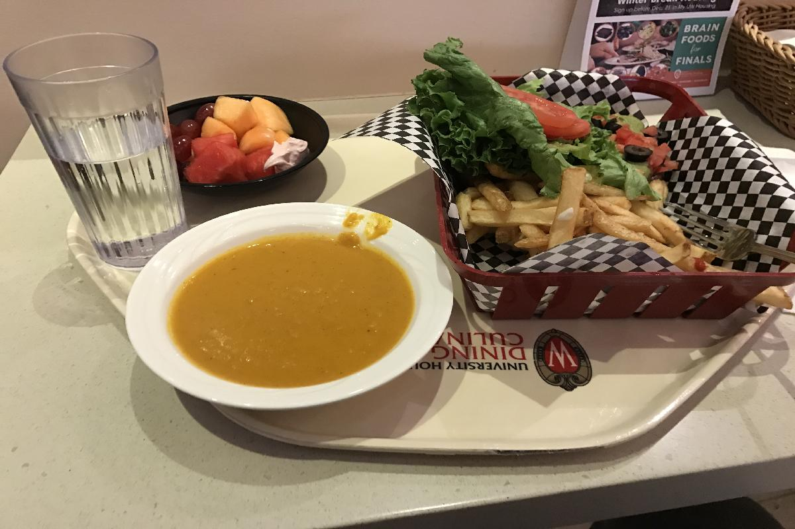
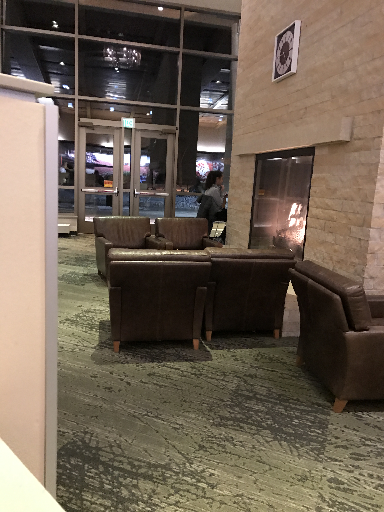
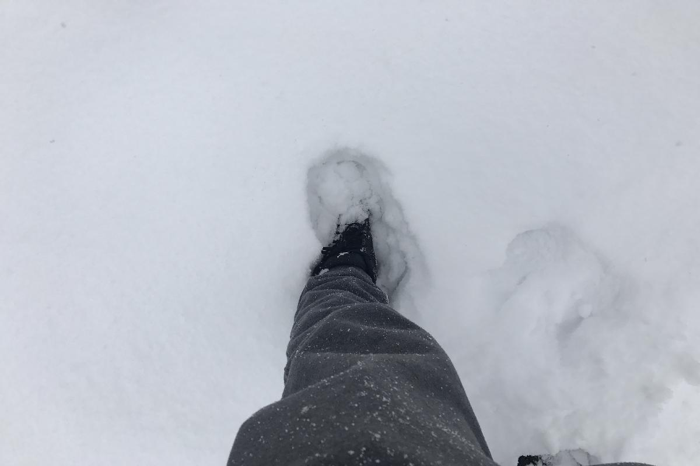
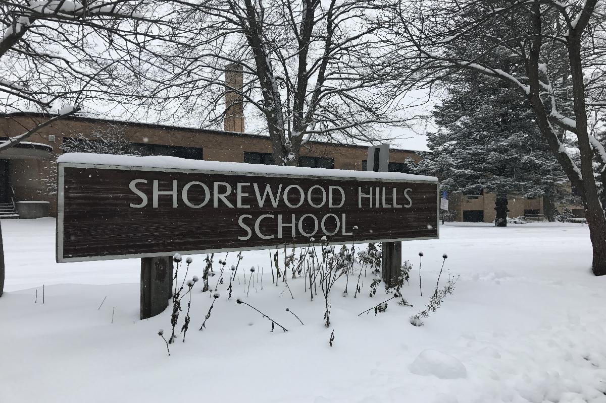
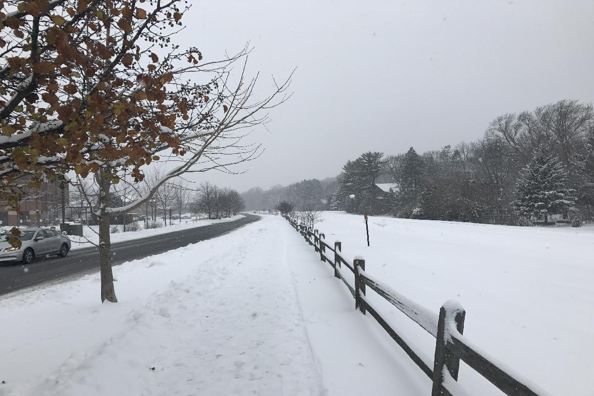
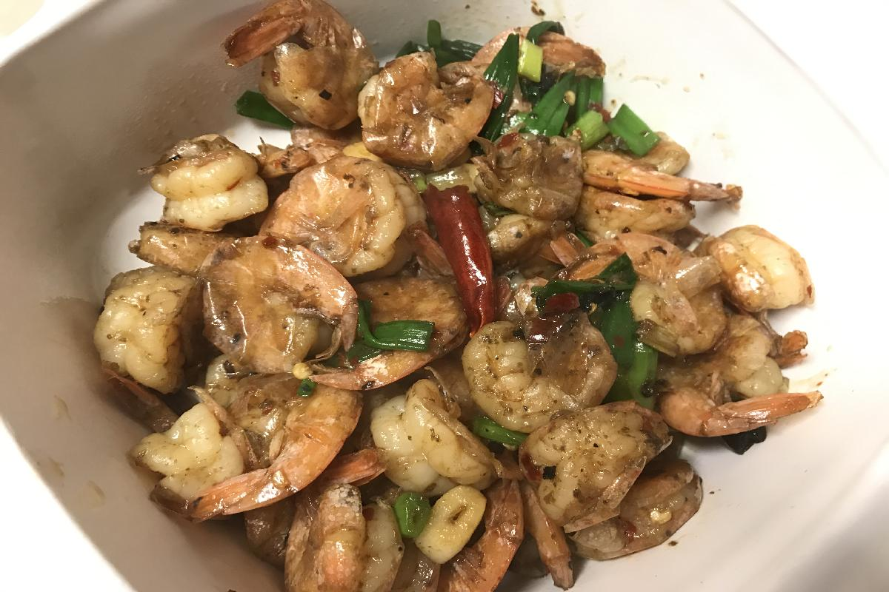

title: Eating and More
date:
category: 
---
# Day 78, Tuesday, Dec 13 2016
## 所吃与所想   Eating and More
- Four Lakes食堂一片金色的灯光下，我坐在大厅一角高高的吧台椅上，熊熊的炉火在身旁的壁炉内跳跃，窗外大雪纷飞。有些过了饭点，吃饭的人已不多，沙发上的学生们多是在眉飞色舞的聊天，周围一片欢声笑语。我拿起面前的汉堡狠狠咬了一口，薯条蘸了点辣酱，在这陌生的语言中，开心地看着这群自在的少年。
- 最近常去湖边这家学校食堂，吃了两个多月中餐，再来这里俨然有点西式餐厅的韵味。目前只试过汉堡薯条沙拉，外加两种浓粥，热量够，也很合我的胃口。还有诸如面条，寿司，各种咖喱饭等等，有待体验，特别最近考试周，食堂宣传画上增加了许多Brain food，也就是一些营养大脑的食材，例如今天汉堡里的牛油果酱，格外令人欢喜。价格方面，一份汉堡薯条加自选水果沙拉也就$7左右，加份浓汤一共$10，不过是一份中式快餐的价格，再加上这里温暖的环境，浓郁的学生氛围以及紧邻学校体育馆的地理优势，估计以后会在我的三餐中扮演极为重要的角色。
- 上周与家里视频，爸爸又提到了每天写点东西的事情。想想的确惭愧，又好久没写了，其实这段时间还是经历了很多有趣的事情，但一不小心又放下了，其实不光日记，很多事情如果不时刻留心， 想起来时已经后悔莫及。说到写作，这里多谈一点，虽说从小到大语文作文都还不错，也一直受父亲熏陶，但我自认为还是没什么天赋，特别是最近看了[王昱珩- 一个人可以多有才华](http://mt.sohu.com/20161121/n473761645.shtml) 这篇文章，让我对天赋又有了些新的理解。王昱珩因为最强大脑节目中令人惊叹的观察分析能力走红，这里不多赘述，其实这档节目我并没有看过，只是从各种报道中略窥一二。文章中触动到我的部分是关于王昱珩自己的专业 - 绘画的描写 
> 一般绘画都是先定出比例轮廓，然后由整体到细节画；但王昱珩起手直接就从物体的眼睛开始画。这样画会极大增加难度，绘画的准确度与整体性，也极大考验画面效果。
- 有兴趣的朋友可以点开原文体验下这种创作方式的震撼。我觉得这种境界是最难的，从具体某点着手进而完成全局，就像写小说先完成中间某个章节，拍电影直接开始某个镜头，这需要心中有多么精准地把控和宏大的想象。同时，我想用这种方式的人通常会一气呵成，创作时间也应该也不会很久。**我想所谓天赋其实在于两点，不拘一格的方式和行云流水的速度，勤奋的后天训练往往不能二者得兼。**而王昱珩的绘画，恰恰让我看到了天赋自然地流淌。反过来想想自己，常常想讲清一件事情还要理半天思路，看来的确是能力有限，只好多多练习了。
- 说到每天坚持，能通过这些微不足道的小事能给关心我的家人带来快乐，这是目前我最大的动力。上周与两个朋友一起吃自助，朋友谈到一位物理Ph.D师兄，选择博士退学重修CS的Master然后找工作，一学期修完5门专业课，还兼着一门TA，叹为观止，朋友问其原因，答曰结婚后体会到作为一个男人的责任。 虽说只是简单旁听了几门课，但我知道5门课+TA的强度远非常人能承受，也是十分佩服。想想最近生活又趋于懒散，时间飞逝，目标依然遥远，许多计划一拖再拖，我的责任又在哪里呢？ 一个常常睡觉想的问题，没有紧迫的生活压力，没有从底层向上爬的心酸，日子就真的可以慢慢过吗？也许我已经落后了。最近看得一个关于人性和人工智能的科幻剧WestWorld中有关于意识形成的探讨，剧中认为意识的形成就像一个迷宫，不断从外层向内层探寻，最外层是各种回忆片段等原始素材，然后会根据这些不断产生问题，诱使自己回答并探索答案，最终一层层深入，知道产生意识。现在想想，好像的确有点意思，也许不断的问自己些问题，思考他们的答案，能产生一些更深層次的变化呢。不管怎样，为了自己，为了关心自己的家人，为了未来想要的生活，我想就是目前最好的鞭策吧。

## Snapshot

- 这几天在Four Lakes食堂的大餐，一份汉堡薯条大餐，一份水果沙拉，一份南瓜浓汤。

- 食堂壁炉里熊熊的火焰。

- 在测量一下雪的深度，这两周周末连续下了大雪，听说雪消融应该是明年四月的事情了。

- 公寓旁的社区小学，写着校名的木派在雪中别有韵味。

- 周日步行去超市，一片白雪皑皑，铁轨已经无踪无影。

- 上周尝试的辣炒虾球，好像做饭的确有点天赋，可惜。
